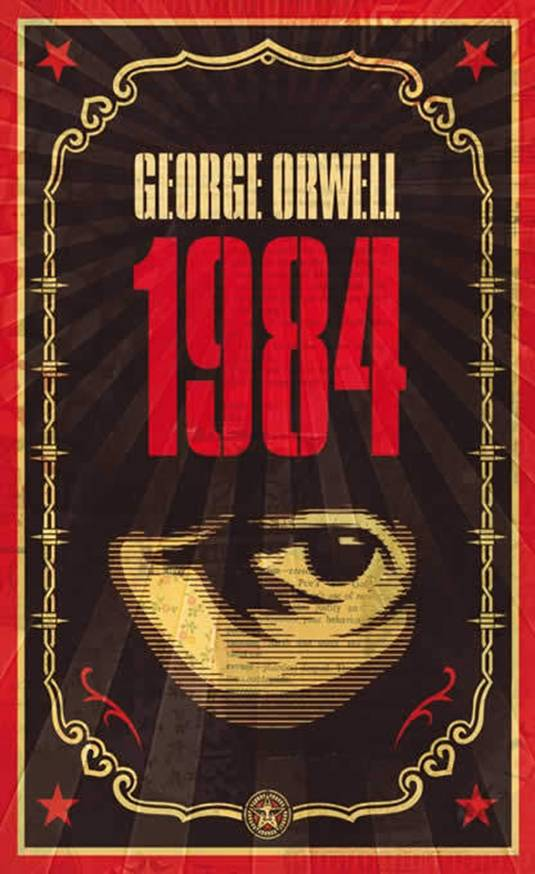

# 《1984》 — 乔治·奥威尔

## 介绍

《1984》是英国作家乔治·奥威尔于1949年创作的一部反乌托邦小说。它被认为是世界文学史上最重要的著作之一，深刻地反映了政治操控、言论自由和社会控制等主题。

## 主要角色

- **温斯顿·史密斯：** 故事的主人公，一名反叛者，试图逃离充满监视和控制的社会。
- **朱莉娅：** 温斯顿的爱人，共和党内的一名成员，与温斯顿一同反抗政府。

## 主题

- **政治操控：** 小说揭示了政府如何操控和歪曲信息，以控制公众的思想。
- **言论自由：** 通过"新闻部"等手段，政府限制了人们的言论自由，塑造了他们的观念。
- **社会控制：** 通过大规模的监视和思想矫正，政府实现对社会的极端控制。

## 影响与启示

1. **当代意义：** 尽管小说创作于20世纪中期，但它的主题和对政治极权的揭示在当代仍然具有深刻的意义。
2. **个体反抗：** 《1984》鼓励个体对不公正和专制的反抗，强调个体思想的重要性。
3. **思想警示：** 作为一部政治寓言，小说是对当时和未来社会可能面临的政治威胁的警示。

## 结论

《1984》是一部令人深思的文学作品，对当代社会的政治和社会问题仍然具有深刻的启示。

